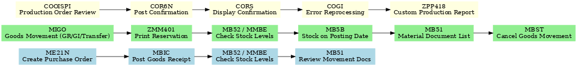

# SAP MM–PP Data Analytics: Warehouse and Production Optimization Project

## Project Overview
This project demonstrates my expertise in **SAP MM (Materials Management) and SAP PP (Production Planning),** focusing on **Warehouse Management, Production Operations, Inventory Control, and Reporting.** By leveraging key SAP transaction codes as **MIGO, MIRO, MB52, MB51, MB5B, MM01, MBIC, COOISPI, and ZPP418, COR6N, COGI**, I streamlined warehouse processes, optimized production material flows, improved reconciliation and inventory accuracy, automated reporting  and enhanced overall supply chain efficiency.

## Scope of Work
The project covers the end-to-end process flow, including:
- **Goods Receipt (GR)** – Receiving materials into stock.
- **Goods Issue (GI)** – Issuing materials to production, cost centers, or sales.
- **Transfer Posting** – Internal stock transfers within or across plants.
- **Invoice Verification** – Matching supplier invoices against purchase orders and goods receipts.
- **Stock in Transit Management** – Monitoring and reconciling in-transit stock.
- **Physical Inventory Adjustments** – Managing stock counts, corrections, and posting differences.
- **Production Order Management** – Tracking, confirming, and correcting production-related material movements.
  
---

## Key SAP Transaction Codes Utilized

### Production Support (SAP PP Integration) 

| **T-Code** | **Description** | **Utilization** |
|------------|-----------------|-----------------|
| COOISPI | Production Order Info System | Reporting on production orders and material consumption. |
| ZPP418 | Custom Transaction (Plantt-Specific) | Used for production/planning reports and logistics KPIs. |
| MB21 | Create Reservation | Reserve stock for future use (e.g., production). |
| MB22 | Change Reservation | Adjust reserved stock quantities/dates. |
| COGI | Postprocessing of Automatic Goods Movements | Correction of failed production postings. |
| CORS | Display Confirmation of Production Order | Review posted confirmations for production operations. |
| ZMM401 | Custom MM T-code for Printing Reservation | Used to generate and print reservation slips for material movement in the warehouse or production |

---

## Warehouse & Inventory Management (Stock Management)  

| **T-Code** | **Description** | **Utilization** |
|------------|-----------------|-----------------|
| MB5B | Stocks for Posting Date | Check stock values on specific dates (e.g., month-end). |
| MBIA | Goods Issue | Record stock removal (e.g., for production). |
| MBIB | Transfer Posting | Move materials between storage locations. |
| MBIC | Goods Receipt | Post incoming goods into stock. |
| MIGO | Goods Movement| GR, GI, Transfer Posting |
| MBST | Cancel Goods Movement | Reversal of incorrect transactions. |
| MB52 | Warehouse Stock Overview | Check stock balance by material/location. |
| MB51 | Material Document List | Audit trail of goods movement & postings. |

---

## Reporting & Master Data  

| **T-Code** | **Description** | **Utilization** |
|------------|-----------------|-----------------|
| MB5T | Stock in Transit | Track goods moving between plants before receipt. |
| MMBE | Stock Overview | View stock availability across plants & storage. |
| MM01 | Create Material Master | Add new materials (raw, finished, or packaging). |
| MM02 | Change Material Master | Edit existing material data. |
| MM03 | Display Material Master | View material details for reference. |

---

## Procurement/Purchasing

| **T-Code** | **Description** | **Utilization** |
|------------|-----------------|-----------------|
| ME21N | Create Purchase Order | Generate vendor purchase orders. |
| ME22N | Change Purchase Order | Modify quantities, prices, or dates. |
| ME23N | Display Purchase Order | Review PO details across departments. |
| ME52N | Change Purchase Requisition | Adjust material requests before PO creation. |
| ME53N | Display Purchase Requisition | View requisition details for approval. |
| ME11 | Create Purchasing Info Record | Link material to vendor pricing & conditions. |
| ME13 | Display Purchasing Info Record | Review vendor-material relationship. |

---

## Warehouse Operations Workflow
- MIGO – Post Goods Movement (GR, GI, or Transfer Posting).
- ZMM401 – Print Reservation slip for internal warehouse material request.
- MB52 / MMBE – Review current stock levels across storage locations.
- MB5B – Check stock as of a specific posting date.
- MB51 – Display material document list for traceability and auditing.
- MBST – Cancel goods movement if errors are detected.

## Production Operations Workflow

- COOISPI – Review production orders (status, material requirements, capacity).
- COR6N – Post production order confirmation (yield, scrap, activity).
- CORS – Display posted confirmations for review and accuracy.
- COGI – Reprocess or correct automatic goods movement errors from production.
- ZPP418 – Run custom production/warehouse report for KPIs.
---

## 📊 Workflow Diagram  

  

---

## About Me  

I am a **Certified Data Analyst & Manufacturing/Warehouse Professional** with over **10 years of experience** in **supply chain operations and ERP systems**.  
I specialize in:  
- SAP MM (Materials Management) and SAP PP (Production Planning)
- Data Analysis & Reporting (Excel, SQL, Power BI, Tableau)  
- Warehouse Operations & Production Planning  

🔗 Connect with me on [LinkedIn](https://www.linkedin.com/in/kelvinayogu39)  
📂 Explore more of my projects on [GitHub](https://github.com/Kelvin96-Analyst)  

> **Disclaimer**:
All SAP transactions, process flows, and data presented in this project are used solely for **portfolio and educational demonstration purposes.** They do **not include or represent any proprietary, confidential, or actual company data**. All examples are **simulated to showcase SAP MM and PP functional and analytical capabilities** only.
